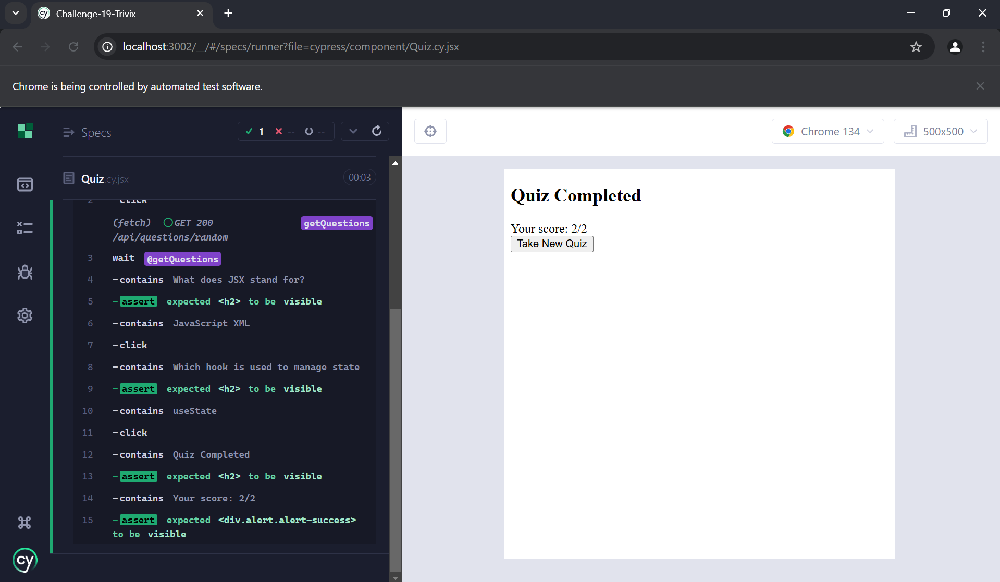

# Trivix

## Table of Contents
- [Description](#description)
- [Screenshots](#screenshots)
- [Installation](#installation)
- [Usage](#usage)
- [Features](#features)
- [License](#license)
- [Contributing](#contributing)
- [Tests](#tests)
- [Credit](#credit)
- [Project Links](#project-links)
- [Questions](#questions)

## Description

Trivix is a full-stack quiz application built with the MERN stack. This project focused on adding both End-to-End (E2E) and Component tests to ensure reliability and a great user experience. Users can start a quiz consisting of 10 randomized tech-related questions. After completing the quiz, their score is shown with the option to take another quiz.

## Screenshots

Here are some previews of the webpage:

###  Start Quiz

### Answer Questions

### After Answering All Questions, View Score

### E2E Test Passing

### Component Test Passing

## Installation

1. Clone the repository:

git clone https://github.com/alyssadailey/Trivix.git

2. Navigate into the project directory:

cd Challenge-19-Trivix

3. Install dependencies:

npm install

4. Start the server:

npm run start:dev

5. Run tests:

npm run test

## Usage

1. Open the app and click Start Quiz.

2. Answer 10 randomized multiple-choice questions.

3. View your score at the end.

4. Click to restart the quiz and try again.

## Features

- Randomized Questions: Every quiz gives a new combination of questions.

- Score Tracking: View your score after completing the quiz.

- Retake Quiz: Easily start another round.

- Component Testing: React components tested with Cypress for reliability.

- E2E Testing: Full quiz flow tested for real-world user behavior.

- REST API: Fetches quiz questions via Express.js and MongoDB.

## License

This application is covered under the MIT license.

## Contributing

If you would like to contribute to my project please follow these steps!

1. Fork the repository on GitHub.
2. Clone your fork to your computer.
3. Create a new branch for your changes.
4. Make your changes and commit them using descriptive messages.
5. Push your branch and open a pull request!

## Tests

To test run:
 npm run test

## Credit

-Utilized Chat GPT to answer any questions I had throughout project.

## Project Links

Repository: https://github.com/alyssadailey/Trivix

Video Demo: https://www.loom.com/share/390c27e0bd534fed8f0c75810e5ed8cb?sid=c365b8a8-85e8-47dc-be2d-2a42431f06a6

## Questions

Please reach me here with additional questions:

Github: https://github.com/alyssadailey  
Email: alyssadailey28@gmail.com 

💻 Happy coding!

